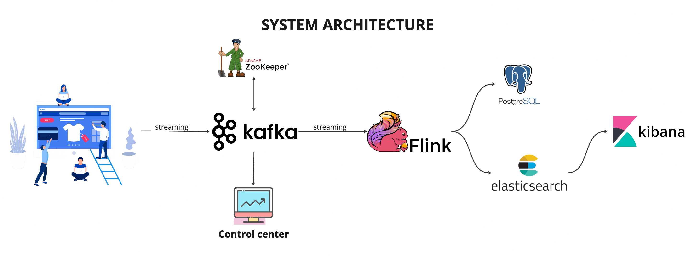

# Real-Time E-Commerce Sales Analytics Pipeline

This repository contains an **Apache Flink** application designed for real-time **sales analytics** in an **E-Commerce** setting. The application processes financial transaction data from **Kafka**, performs aggregations, and stores the results in **Postgres** and **Elasticsearch** for further analysis.

## 🚀 Features
- Real-time financial transaction processing using **Apache Flink**
- Data ingestion from **Kafka**
- Aggregations and transformations on transaction streams
- Data storage in **Postgres** for structured queries
- Data indexing in **Elasticsearch** for analytics and visualization
- Fully containerized setup using **Docker Compose**

---

## 📌 Requirements
- [Docker](https://www.docker.com/)
- [Docker Compose](https://docs.docker.com/compose/)
- [Apache Flink](https://flink.apache.org/)
- [Kafka](https://kafka.apache.org/)
- [Postgres](https://www.postgresql.org/)
- [Elasticsearch](https://www.elastic.co/elasticsearch/)

---

## 🏗 Architecture
The system processes transaction data through the following pipeline:

1. **Python Script (`main.py`)** - Generates and publishes sales transactions to Kafka.
2. **Kafka Consumers** - Reads transaction data from Kafka.
3. **Flink (`DataStreamJob.java`)** - Processes, aggregates, and transforms streaming data.
4. **Postgres** - Stores structured transaction data and analytics tables.
5. **Elasticsearch** - Indexes transaction data for analytics and fast querying.



---

## 🛠 Installation and Setup

### Clone the Repository
```sh
 git clone https://github.com/yourusername/flink-ecommerce-analytics.git
 cd flink-ecommerce-analytics
```

### Start Required Services
```sh
 docker-compose up -d
```
This starts **Flink**, **Kafka**, **Postgres**, and **Elasticsearch**.

### Generate Transaction Data
Run the following Python script to generate mock sales transactions:
```sh
 python main.py
```

### Build and Run the Flink Application
```sh
mvn clean
mvn compile
mvn package
```
Run the Flink job using:
```sh
/opt/homebrew/Cellar/apache-flink/1.20.0/bin/flink run -c flinkecommerce.DataStreamJob target/flinkecommerce-1.0-SNAPSHOT.jar
```

### Verify Data Processing
- **Postgres**: Check the database for streaming data.
- **Elasticsearch**: Query indexed data for analytics.
- **Flink UI**: Monitor job status at [http://localhost:8081](http://localhost:8081).

---

## 📂 Code Structure
```
flink-ecommerce-analytics/
│── src/main/java/flinkecommerce/
│   ├── DataStreamJob.java         # Flink processing logic
│   ├── Deserializer               # Custom Kafka deserializer
│   ├── Dto                        # Data Transfer Objects (DTOs)
│   ├── utils                      # Utility functions
│── docker-compose.yml             # Containerized setup
│── main.py                        # Sales transaction generator
│── pom.xml                        # Maven dependencies
│── README.md                      # Project documentation
```

---

## 🔧 Configuration
### Kafka Settings
- Bootstrap Servers: `localhost:9092`
- Topic: `transactions`
- Consumer Group ID: `flink-consumer`

### Postgres Settings
- URL: `jdbc:postgresql://localhost:5432/ecommerce`
- Username: `postgres`
- Password: `password`

### Elasticsearch Settings
- Host: `http://localhost:9200`
- Index: `transactions`

---

## 🔗 Dependencies (Added in `pom.xml`)
- **Kafka Connector**: `flink-connector-kafka`
- **Postgres Connector**: `flink-jdbc`
- **Elasticsearch Connector**: `flink-connector-elasticsearch`
- **Lombok**: `lombok`

---

## 📝 Running Flink on Mac (VS Code)
### Install Required Tools
```sh
brew install maven apache-flink
```

### Create a Maven Project
```sh
mvn archetype:generate \  
  -DarchetypeGroupId=org.apache.flink \  
  -DarchetypeArtifactId=flink-quickstart-java \  
  -DarchetypeVersion=1.16.0 \  
  -DgroupId=com.example \  
  -DartifactId=flink-project \  
  -Dversion=1.0-SNAPSHOT \  
  -DinteractiveMode=false
```

### Start Flink Cluster
```sh
cd /opt/homebrew/Cellar/apache-flink/1.20.0/libexec
bin/jobmanager.sh start
bin/taskmanager.sh start
```

---

## 🏆 Contribution
Feel free to open issues or submit pull requests to improve this project.

---

## 📜 License
This project is licensed under the [MIT License](https://github.com/NvkAnirudh/Real-Time-ECommerce-Sales-Analytics-Pipeline/blob/main/LICENSE).

---

## 📞 Contact
For questions, reach out to **your.email@example.com** or create an issue in this repository.

---

Enjoy real-time sales analytics with **Apache Flink** 🚀!
